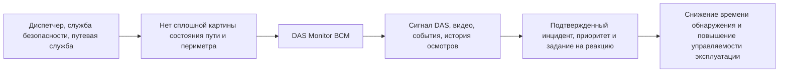

# 01. Описание системы

## Название

Рабочее название: **DAS Monitor ВСМ**.

Система предназначена для сплошного мониторинга железнодорожного пути ВСМ Москва - Санкт-Петербург при помощи распределенного акустического зондирования, видео-подтверждения, ИИ-классификации и базового цифрового двойника пути.

## Проблема

Высокоскоростная магистраль требует непрерывного контроля пути, основания, периметра и аномалий подвижного состава. Разрозненные точечные датчики дают неполную картину: они контролируют отдельные места, плохо масштабируются на сотни километров и не всегда позволяют быстро связать сигнал, место события, видео-подтверждение и действия эксплуатационных служб.

Для ВСМ особенно критичны:

- смещение основания под безбалластной конструкцией;
- локальные деформации и оползневые процессы;
- вторжения людей, животных и техники в опасную зону;
- дефекты колесных пар и ударные сигналы подвижного состава;
- необходимость быстро показать оператору не только тревогу, но и контекст события.

## Целевые пользователи

| Пользователь | Потребность |
|---|---|
| Диспетчер / оператор мониторинга | Видеть карту событий, карточки инцидентов, видео-подтверждение и текущий приоритет |
| Служба безопасности | Получать подтвержденные события вторжения и понимать место, время, видео и уровень риска |
| Путевая служба | Получать задания на осмотр или ремонт с координатой, причиной и историей события |
| Инженер эксплуатации системы | Видеть состояние edge-узлов, очередей, моделей, камер и потоков данных |
| ML-инженер | Анализировать качество классификации, ложные тревоги и версии моделей |

## Основные сценарии MVP

- Обнаружить вторжение в периметр пути.
- Определить проход поезда и расчетную скорость на участке.
- Выявить возможный дефект колесной пары по ударной сигнатуре.
- Обнаружить смещение основания или оползневый процесс.
- Запросить ближайшую камеру и фрагмент записи по координате и времени.
- Создать карточку инцидента и вывести ее оператору.
- Подтвердить или отклонить инцидент.
- Сформировать задание путевой службе на осмотр или ремонт.
- Обновить цифровой двойник пути по подтвержденным событиям и результатам осмотров.

## Как пользователь получает результат

Оператор работает через АРМ в браузере. В интерфейсе отображаются:

- карта трассы с событиями;
- список активных инцидентов;
- карточка инцидента с координатой, временем, типом события, критичностью, источниками сигнала и видео;
- история действий и комментариев;
- кнопки подтверждения, отклонения и создания задания.

Путевая служба получает задание на осмотр или ремонт в рамках системы MVP. Интеграция с внешними системами управления работами рассматривается как развитие после первой версии.

## Границы MVP

В MVP входит:

- покрытие всей линии ВСМ как целевой архитектуры;
- обработка DAS-сигналов на edge-узлах;
- передача событий и признаков в центральный контур;
- ИИ-классификация ограниченного набора классов событий;
- видео-подтверждение через ближайшие камеры;
- ручное подтверждение оператором;
- карточки инцидентов и задания путевой службе;
- базовый цифровой двойник с состоянием участков, трендами и историей подтвержденных событий.

В MVP не входит:

- автоматическое управление движением поездов;
- автоматическое ограничение скорости без оператора и действующих диспетчерских процедур;
- полная интеграция с внешним диспетчерским контуром;
- метеоинтеграция как обязательная зависимость;
- хранение непрерывного сырого DAS-потока в центральном контуре;
- расширенная предиктивная аналитика на уровне полноценной системы технического обслуживания по состоянию.

## Карта ценности

## Критерии успеха MVP

| Критерий | Целевой показатель MVP |
|---|---|
| Покрытие трассы | Все участки линии представлены в цифровой карте и привязаны к edge-узлам |
| Обработка события | Кандидат события появляется в системе без ручного ввода |
| Видео-подтверждение | Для события система автоматически выбирает ближайшую доступную камеру или фиксирует причину отсутствия видео |
| Работа оператора | Оператор может подтвердить, отклонить или отправить инцидент в работу из одной карточки |
| Трассируемость | Для каждого инцидента сохранены источник сигнала, версия модели, действия оператора и связанные артефакты |
| Безопасность | Система не выполняет эксплуатационные действия без подтверждения оператора |
| Развитие | Архитектура допускает добавление метеоданных, внешнего диспетчерского контура и расширенных моделей без полной переработки |
