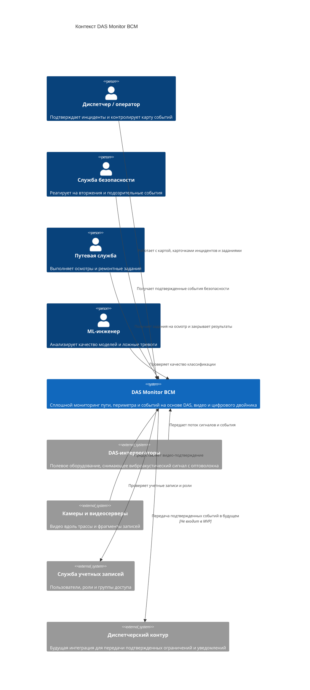

# 02. Контекст и границы

## Назначение раздела

Раздел показывает систему DAS Monitor ВСМ в окружении: пользователей, внешние источники данных, каналы управления и границы ответственности MVP.

## Контекстная диаграмма

## Входы системы

| Вход | Источник | Назначение |
|---|---|---|
| DAS-сигнал и признаки | DAS-интеррогаторы через edge-узлы | Обнаружение событий, классификация, построение сигнатур |
| Видео и фрагменты записей | Камеры и видеосерверы | Подтверждение инцидента оператором |
| Действия оператора | АРМ оператора | Подтверждение, отклонение, комментарии, создание задания |
| Результаты осмотра | Путевая служба | Закрытие задания и уточнение цифрового двойника |
| Версии моделей | ML-инженер / реестр моделей | Воспроизводимость классификации |

## Выходы системы

| Выход | Получатель | Формат |
|---|---|---|
| Кандидат события | Оператор мониторинга | Карточка на карте и в очереди событий |
| Подтвержденный инцидент | Оператор, служба безопасности, путевая служба | Карточка инцидента с критичностью и доказательствами |
| Задание на осмотр или ремонт | Путевая служба | Задание с координатой, причиной и приоритетом |
| Индекс состояния участка | Оператор, инженер эксплуатации | Значение в цифровом двойнике и тренд |
| Журнал аудита | Инженер эксплуатации, аудит | Неизменяемая история действий и решений |

## Что внутри границ MVP

- Центральная платформа мониторинга.
- Edge-обработка DAS-потока на участках трассы.
- Очередь и потоковая обработка событий.
- Backend API.
- АРМ оператора.
- ML workers для классификации.
- Сервис оценки критичности.
- Сервис видео-подтверждения.
- Сервис цифрового двойника.
- Хранилища событий, временных рядов и артефактов.
- Журнал аудита.

## Что остается внешней зависимостью

- DAS-интеррогаторы как физическое оборудование.
- Камеры, видеосерверы и их доступность.
- Учетная запись и корпоративная система ролей.
- Регламенты диспетчерского управления движением.
- Полевая инфраструктура связи вдоль трассы.
- Внешние системы управления ремонтами, если они появятся после MVP.

## Границы ответственности

| Область | Ответственность DAS Monitor ВСМ | Вне ответственности MVP |
|---|---|---|
| Обнаружение | Принять признаки, классифицировать событие, создать карточку | Гарантировать физическую исправность оптоволокна и интеррогатора |
| Видео | Найти ближайшую камеру и запросить фрагмент | Управлять всей системой видеонаблюдения |
| Реакция | Показать инцидент, приоритет и сформировать задание | Автоматически менять режим движения поездов |
| Данные | Хранить события, доказательства, статусы и аудит | Хранить весь непрерывный сырой DAS-поток централизованно |
| Цифровой двойник | Вести состояние и тренды участков по подтвержденным событиям | Давать нормативно обязательный прогноз ресурса пути |

## Интеграции MVP и развитие

| Интеграция | Статус в MVP | Комментарий |
|---|---|---|
| DAS-интеррогаторы | Обязательная | Основной источник сигналов |
| Камеры и видеосерверы | Обязательная | Нужно для подтверждения и снижения ложных тревог |
| АРМ оператора | Обязательная | Основной канал работы пользователя |
| Служба учетных записей | Желательная | Можно заменить локальными ролями для стендового запуска |
| Диспетчерский контур | Будущее развитие | В MVP система только готовит подтвержденные события |
| Метеоданные | Будущее развитие | Полезно для цифрового двойника, но не входит в первую версию |
| Внешняя система ремонтов | Будущее развитие | В MVP задания ведутся внутри системы |
