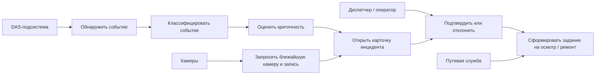

# 03. Требования

## Функциональные требования

| Код | Требование | Приоритет | Как проверить |
|---|---|---|---|
| FR-001 | Система должна принимать события и признаки DAS от edge-узлов по всей линии ВСМ | Must | Интеграционный тест с эмулятором edge-узла |
| FR-002 | Система должна классифицировать события минимум по классам: поезд, вторжение, работы рядом с путем, животное, дефект колесной пары, смещение основания, шум/неизвестно | Must | Набор тестовых сигналов и проверка результата классификации |
| FR-003 | Система должна рассчитывать критичность события: нормальное, предупреждение, инцидент | Must | Unit-тест правил критичности и интеграционный тест обработки события |
| FR-004 | Система должна определять координату события на трассе и привязывать ее к участку пути | Must | Тест геопривязки в PostGIS |
| FR-005 | Система должна выбирать ближайшую доступную камеру по координате и времени события | Must | Интеграционный тест с каталогом камер |
| FR-006 | Система должна создавать карточку инцидента с типом, временем, координатой, критичностью, видео и источниками сигнала | Must | E2E-сценарий "DAS-событие -> карточка" |
| FR-007 | Оператор должен иметь возможность подтвердить, отклонить или отправить инцидент в работу | Must | E2E-тест АРМ |
| FR-008 | Система должна формировать задание путевой службе по подтвержденному инциденту | Must | E2E-тест создания задания |
| FR-009 | Система должна хранить историю действий по инциденту и заданию | Must | Проверка audit trail |
| FR-010 | Система должна обновлять базовый цифровой двойник по подтвержденным событиям и результатам осмотров | Should | Интеграционный тест обновления состояния участка |
| FR-011 | ML-инженер должен видеть версию модели, использованную для классификации события | Should | Проверка карточки события и данных в БД |
| FR-012 | Система должна показывать причины, по которым видео-подтверждение недоступно | Should | Тест отказа камеры или видеосервера |

## Нефункциональные требования

| Код | Требование | Приоритет | Как проверить |
|---|---|---|---|
| NFR-001 | Кандидат события должен появляться в центральной системе не позднее 30 секунд после обнаружения edge-узлом в нормальном режиме связи | Must | Нагрузочный и интеграционный тест pipeline |
| NFR-002 | Потеря связи с edge-узлом не должна приводить к потере уже подтвержденных инцидентов | Must | Тест отказа связи и восстановления |
| NFR-003 | Повторная доставка одного события не должна создавать дубликаты инцидента | Must | Тест идемпотентности по `event_id` |
| NFR-004 | Система должна хранить audit trail для всех действий оператора и путевой службы | Must | Интеграционный тест аудита |
| NFR-005 | Система должна поддерживать горизонтальное масштабирование ML workers и consumer-процессов Kafka | Must | Нагрузочный тест с несколькими workers |
| NFR-006 | Сырые акустические и видеофрагменты должны быть доступны только авторизованным ролям | Must | Security integration test |
| NFR-007 | Центральный контур должен быть наблюдаемым через логи, метрики, трассировку и доменные события | Must | Проверка метрик и логов в тестовом окружении |
| NFR-008 | Система должна позволять заменить модель классификации без миграции исторических инцидентов | Should | Тест регистрации новой версии модели |
| NFR-009 | Хранение артефактов должно иметь политику удаления и не расти без контроля | Should | Тест cleanup job и метрик объема |

## Продуктовые правила

| Правило | Значение MVP | Где применяется | Как проверить |
|---|---|---|---|
| Классы событий MVP | Поезд, вторжение, работы, животное, дефект колесной пары, смещение основания, шум/неизвестно | ML workers, АРМ, аналитика | Contract tests и тестовый датасет |
| Критичность | `normal`, `warning`, `incident` | Сервис оценки критичности, АРМ, уведомления | Unit-тест правил |
| Подтверждение оператора | Обязательно перед созданием задания с высоким влиянием | АРМ, API, audit trail | E2E-тест роли оператора |
| Хранение сырого DAS | Централизованно хранятся только фрагменты вокруг значимых событий | Edge-узел, S3/MinIO, cleanup | Проверка политики записи |
| Видео-подтверждение | Запрашивается ближайшая доступная камера вокруг времени события | Сервис видео-подтверждения | Интеграционный тест |
| Версия модели | Фиксируется в каждом результате классификации | ClassificationResult, AuditLog | Проверка данных |
| Идемпотентность | `event_id` уникален в рамках источника и временного окна | API, consumers, БД | Тест повторной доставки |

## Use-case схема

## Ошибочные и альтернативные сценарии

| Сценарий | Ожидаемое поведение |
|---|---|
| Камера недоступна | Инцидент создается без видео, в карточке сохраняется причина отсутствия доказательства |
| Edge-узел повторно отправил событие | Система обновляет существующую запись или игнорирует дубль по `event_id` |
| ML-модель вернула низкую уверенность | Событие помечается как `unknown` или `needs_operator_review` |
| Оператор отклонил тревогу | Инцидент получает статус `rejected`, событие сохраняется для обучения и анализа ложных тревог |
| Путевая служба не подтвердила проблему на осмотре | Задание закрывается с результатом осмотра, цифровой двойник обновляется без ухудшения индекса |
| Потеря связи с edge-узлом | Центральная система показывает деградацию покрытия и алерт инженеру эксплуатации |

## Открытые вопросы

| Вопрос | Влияние | Как закрыть |
|---|---|---|
| Реальная допустимая задержка обнаружения критичного события | Влияет на edge-обработку и SLA | Согласовать с эксплуатацией ВСМ |
| Плотность камер и доступность видеоархива | Влияет на вероятность видео-подтверждения | Получить карту камер и параметры видеосерверов |
| Точные объемы DAS-потока | Влияет на storage и edge-фильтрацию | Провести пилотные замеры с технологическим партнером |
| Регламент передачи заданий путевой службе | Влияет на модель статусов и права | Согласовать с владельцами процесса |
