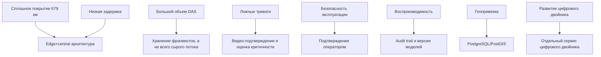

# 04. Архитектурные драйверы

## Ключевые драйверы

| Драйвер | Почему важен | Влияние на архитектуру | Как проверять |
|---|---|---|---|
| Сплошное покрытие линии 679 км | Точечные решения не дают целостной картины | Edge-узлы и интеррогаторы размещаются вдоль трассы, центральный контур получает события со всех участков | Проверка карты покрытия и имитация событий с разных участков |
| Низкая задержка обнаружения | Для ВСМ событие должно быстро попасть к оператору | Предобработка и первичная фильтрация выполняются на edge, центральный контур получает компактные события | Нагрузочный тест pipeline |
| Снижение ложных тревог | Оператор не должен утонуть в шуме | Классификация дополняется оценкой критичности и видео-подтверждением | Тесты на датасете, анализ `rejected` инцидентов |
| Большой объем DAS-данных | Непрерывный сырой поток дорого хранить и передавать | Централизованно хранятся признаки, события и фрагменты вокруг инцидентов | Расчет storage и тест retention policy |
| Геопривязка | Инцидент должен быть связан с участком, камерой и заданием | Нужен PostgreSQL/PostGIS как источник истины по участкам и координатам | Интеграционные тесты геозапросов |
| Воспроизводимость классификации | Нужно понимать, почему событие стало инцидентом | В каждом результате хранится версия модели, признаки и confidence | Проверка `ClassificationResult` и audit trail |
| Безопасность эксплуатации | Ошибочная автоматическая реакция может быть опасна | В MVP любые эксплуатационные действия подтверждает оператор | E2E-тест ролей и статусов |
| Развитие цифрового двойника | Система должна накапливать сигнатуры и историю | Цифровой двойник выделяется в отдельный сервис с собственными правилами обновления | Тест обновления состояния участка |
| Наблюдаемость | Сложная распределенная система требует расследования сбоев | Вводятся correlation ids, метрики, логи, доменные события и алерты | Проверка диагностической цепочки |

## Архитектурные компромиссы

| Компромисс | Выбор MVP | Цена выбора | Почему приемлемо |
|---|---|---|---|
| Полная линия против пилотного участка | Описывается вся линия, но с базовыми функциями | Больше требований к масштабированию и эксплуатации | Соответствует цели курсовой и презентации |
| Edge-обработка против централизованной обработки сырого потока | Первичная фильтрация на edge | Edge-узлы становятся сложнее | Снижает трафик, задержку и стоимость хранения |
| Автоматическая реакция против human-in-the-loop | Оператор подтверждает действия | Реакция может быть медленнее | Безопаснее для MVP и проще согласовать |
| Единое хранилище против разделения по типам данных | PostgreSQL/PostGIS, TimescaleDB, S3/MinIO | Больше инфраструктурных компонентов | Разные типы данных имеют разные требования |
| Цифровой двойник внутри аналитики против отдельного сервиса | Отдельный сервис | Появляется еще одна граница | Упрощает развитие прогноза и рекомендаций |

## Карта влияния драйверов

## Решения, требующие ADR

| Решение | ADR |
|---|---|
| Использовать edge+central архитектуру | [ADR-0001](adr/0001-use-edge-central-architecture.md) |
| Использовать Kafka для потоковой обработки событий | [ADR-0002](adr/0002-use-kafka-for-event-streaming.md) |
| Разделить хранилища по типам данных | [ADR-0003](adr/0003-split-storage-by-data-type.md) |
| Не выполнять эксплуатационные действия без подтверждения оператора | [ADR-0004](adr/0004-require-operator-confirmation-for-actions.md) |
| Выделить цифровой двойник в отдельный сервис | [ADR-0005](adr/0005-make-digital-twin-a-separate-service.md) |
