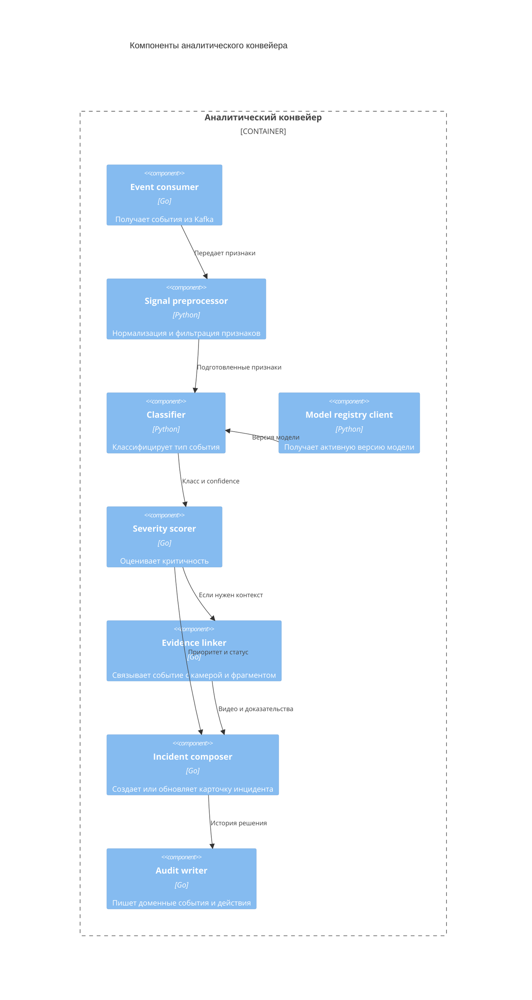

# 05. Архитектура

## Архитектурный стиль

DAS Monitor ВСМ строится как событийная edge+central система.

Edge-узлы размещаются на участках трассы и выполняют первичную обработку DAS-сигнала: фильтрацию, выделение признаков, локализацию события и отправку компактного события в центральный контур. Центральный контур отвечает за потоковую обработку, ИИ-классификацию, оценку критичности, видео-подтверждение, карточки инцидентов, задания, цифровой двойник, аудит и интерфейс оператора.

Главные принципы:

- сырой непрерывный DAS-поток не передается и не хранится централизованно;
- все события имеют устойчивые идентификаторы и correlation ids;
- оператор подтверждает действия, влияющие на эксплуатацию;
- источник истины по инцидентам, заданиям и участкам - PostgreSQL/PostGIS;
- тяжелые артефакты хранятся отдельно от транзакционной БД;
- цифровой двойник обновляется только по подтвержденным событиям и результатам осмотров.

## Контейнерная диаграмма

```mermaid
C4Container
    title Контейнерная диаграмма DAS Monitor ВСМ

    Person(operator, "Диспетчер / оператор", "Работает с инцидентами")
    Person(trackService, "Путевая служба", "Получает задания")
    Person(mlEngineer, "ML-инженер", "Анализирует качество моделей")

    System_Ext(das, "DAS-интеррогаторы", "Полевое оборудование")
    System_Ext(cameras, "Камеры и видеосерверы", "Видео вдоль трассы")
    System_Ext(identity, "Служба учетных записей", "Роли и группы")

    System_Boundary(system, "DAS Monitor ВСМ") {
        Container(edge, "Edge-узлы участков", "Go/Python", "Предобработка DAS, локализация и буферизация событий")
        Container(kafka, "Kafka", "Event streaming", "Потоки событий, признаков и команд обработки")
        Container(api, "Backend API", "Go, HTTPS", "Карточки инцидентов, задания, роли, команды АРМ")
        Container(web, "АРМ оператора", "React/TypeScript", "Карта, очередь инцидентов, видео и действия оператора")
        Container(ml, "ML workers", "Python", "Классификация DAS-событий и оценка confidence")
        Container(severity, "Сервис критичности", "Go", "Правила приоритета и перевод события в инцидент")
        Container(video, "Сервис видео-подтверждения", "Go", "Выбор камеры и запрос фрагмента")
        Container(twin, "Сервис цифрового двойника", "Go/Python", "Состояние участков, тренды и рекомендации")
        ContainerDb(pg, "PostgreSQL/PostGIS", "DB", "Источник истины по участкам, инцидентам, заданиям и аудиту")
        ContainerDb(tsdb, "TimescaleDB", "Time-series DB", "Признаки, временные ряды, агрегаты")
        ContainerDb(objects, "S3/MinIO", "Object storage", "Видео, акустические фрагменты, модели")
    }

    Rel(das, edge, "DAS-сигнал")
    Rel(edge, kafka, "События и признаки")
    Rel(kafka, ml, "События для классификации")
    Rel(ml, kafka, "Результаты классификации")
    Rel(kafka, severity, "Классифицированные события")
    Rel(severity, video, "Запрос видео")
    Rel(video, cameras, "Фрагмент записи")
    Rel(severity, api, "Кандидат инцидента")
    Rel(operator, web, "Работа с инцидентами")
    Rel(trackService, web, "Работа с заданиями")
    Rel(web, api, "HTTPS API")
    Rel(api, identity, "Проверка ролей")
    Rel(api, pg, "Чтение и запись состояния")
    Rel(api, objects, "Ссылки на артефакты")
    Rel(ml, tsdb, "Признаки и агрегаты")
    Rel(ml, objects, "Модели и акустические фрагменты")
    Rel(twin, pg, "События и задания")
    Rel(twin, tsdb, "Тренды")
    Rel(mlEngineer, api, "Просмотр качества моделей")

    UpdateLayoutConfig($c4ShapeInRow="3", $c4BoundaryInRow="1")
```

## Ответственность контейнеров

| Контейнер | Ответственность |
|---|---|
| Edge-узлы участков | Прием DAS-потока, фильтрация шума, выделение признаков, локализация события, временная буферизация при потере связи |
| Kafka | Доставка событий между edge, ML, сервисом критичности, API и цифровым двойником |
| Backend API | Авторизация, карточки инцидентов, задания, audit trail, команды оператора, доступ к данным |
| АРМ оператора | Карта, очередь инцидентов, видео, комментарии, подтверждение и отклонение |
| ML workers | Классификация событий, confidence, фиксация версии модели |
| Сервис критичности | Преобразование классификации в приоритет, правила эскалации и создание кандидата инцидента |
| Сервис видео-подтверждения | Выбор ближайшей камеры, запрос фрагмента, сохранение ссылки на доказательство |
| Сервис цифрового двойника | Состояние участка, индекс состояния, тренды, рекомендации для обслуживания |
| PostgreSQL/PostGIS | Источник истины по участкам, инцидентам, заданиям, ролям и аудиту |
| TimescaleDB | Временные ряды признаков, агрегаты, тренды |
| S3/MinIO | Видео, акустические фрагменты, версии моделей, крупные артефакты |

## Компоненты аналитического конвейера

## Основные интерфейсы

| Интерфейс | Откуда | Куда | Назначение |
|---|---|---|---|
| DAS stream | DAS-интеррогатор | Edge-узел | Непрерывный сигнал или поток измерений |
| Edge event | Edge-узел | Kafka | Компактное событие с координатой, временем и признаками |
| Classification result | ML worker | Kafka / PostgreSQL | Класс события, confidence, версия модели |
| Video request | Сервис видео | Видеосервер | Получить фрагмент по координате и времени |
| Operator API | АРМ | Backend API | Просмотр карточек, подтверждение, отклонение, создание задания |
| Maintenance command | Backend API | Модуль заданий | Создать задание путевой службе |
| Twin update | Backend / Kafka | Сервис цифрового двойника | Обновить состояние участка по подтвержденному событию |

## Ключевые политики

| Политика | Где реализуется | Почему здесь | Как проверить |
|---|---|---|---|
| Идемпотентность событий | Kafka consumers и PostgreSQL unique key по `source_id + event_id` | Повторная доставка не должна создавать дубли | Failure test повторной доставки |
| Подтверждение оператора | Backend API и АРМ | Все действия проходят через авторизованную команду | E2E-тест роли оператора |
| Выбор камеры | Сервис видео-подтверждения и PostGIS | Нужна геопривязка и правила доступности | Интеграционный тест каталога камер |
| Версионирование модели | ML workers и S3/MinIO | Исторические решения должны быть воспроизводимы | Проверка `model_version_id` |
| Хранение артефактов | Edge-узел, S3/MinIO, cleanup job | Сырые фрагменты дороги и чувствительны | Тест retention policy |
| Обновление цифрового двойника | Сервис цифрового двойника | Обновления должны идти только от подтвержденных событий | Интеграционный тест статусов |

## Что сознательно не выделяется в MVP

- Отдельный микросервис пользователей: роли можно получать из службы учетных записей или хранить локально для стенда.
- Отдельная система уведомлений: уведомления в MVP встроены в АРМ.
- Полная интеграция с диспетчерским контуром: события остаются внутри DAS Monitor ВСМ.
- Отдельная платформа управления моделями: достаточно реестра версий моделей в S3/MinIO и метаданных в PostgreSQL.
