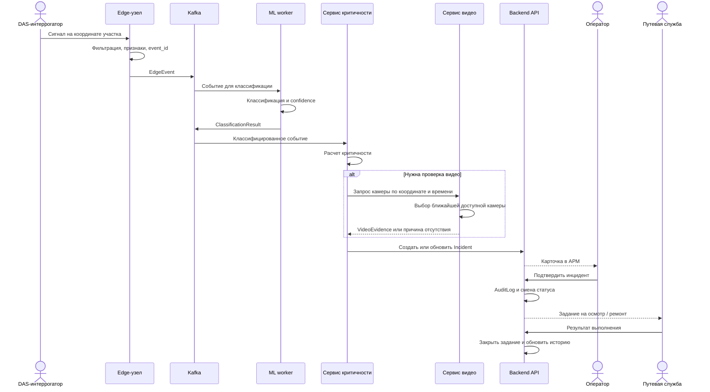
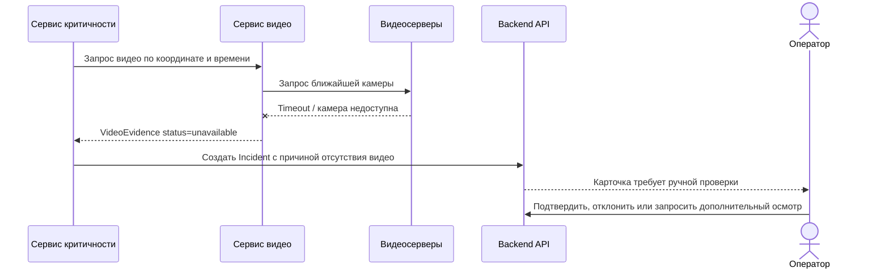
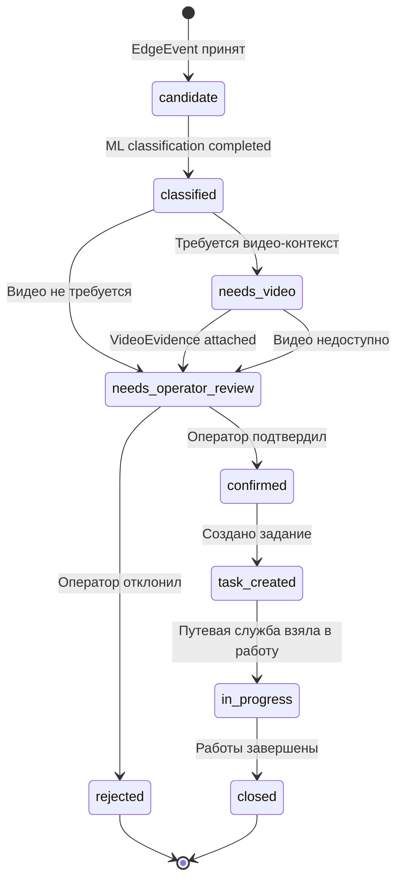

# 06. Сценарии и потоки

## Основной end-to-end сценарий

Сценарий показывает путь от виброакустического события до реакции оператора и путевой службы.

## Альтернативный сценарий: камера недоступна

## Жизненный цикл инцидента

## Правила переходов статусов

| Переход | Кто выполняет | Условия |
|---|---|---|
| `candidate -> classified` | ML worker | Получен результат классификации или класс `unknown` |
| `classified -> needs_video` | Сервис критичности | Событие требует видео-подтверждения |
| `needs_video -> needs_operator_review` | Сервис видео | Видео найдено или зафиксирована причина недоступности |
| `needs_operator_review -> confirmed` | Оператор | Пользователь имеет роль оператора и оставил решение |
| `needs_operator_review -> rejected` | Оператор | Событие признано ложным или несущественным |
| `confirmed -> task_created` | Backend API | Требуется выезд, осмотр или ремонт |
| `task_created -> in_progress` | Путевая служба | Задание принято в работу |
| `in_progress -> closed` | Путевая служба / оператор | Внесен результат и комментарий |

## Сценарии предметной области

| Сценарий | Поток |
|---|---|
| Вторжение в периметр | DAS фиксирует вибрацию, ML классифицирует как человек/животное/техника, система запрашивает камеру, оператор подтверждает, служба безопасности получает инцидент |
| Дефект колесной пары | DAS фиксирует ударную сигнатуру при проходе поезда, ML классифицирует аномалию, оператор видит поезд, участок и риск, создается запись для проверки состава |
| Смещение основания | Накапливаются сигнатуры и тренд участка, сервис цифрового двойника повышает риск, оператор создает задание на осмотр |
| Сторонние работы рядом с путем | DAS фиксирует характерную активность, видео помогает подтвердить технику или работы, оператор передает событие службе безопасности |
| Ложная тревога | Оператор отклоняет инцидент, событие остается в истории для анализа качества модели |

## Повторы и идемпотентность

- Edge-узел присваивает каждому событию `event_id`.
- Центральный контур хранит уникальность по `source_id + event_id`.
- Kafka consumer может безопасно повторно обработать сообщение.
- Создание инцидента выполняется как upsert: если инцидент уже существует, обновляются доказательства и audit trail.
- Создание задания требует отдельной команды оператора и не повторяется без нового `command_id`.

## Асинхронные границы

| Граница | Почему асинхронная |
|---|---|
| Edge-узел -> Kafka | Связь вдоль трассы может быть нестабильной, нужен буфер и backpressure |
| Kafka -> ML workers | Классификация может масштабироваться независимо |
| ML workers -> сервис критичности | Разные версии моделей и разные скорости обработки |
| Сервис видео -> видеосервер | Внешний сервис может отвечать медленно или быть недоступным |
| Backend -> цифровой двойник | Обновление индексов и трендов не должно блокировать работу оператора |
