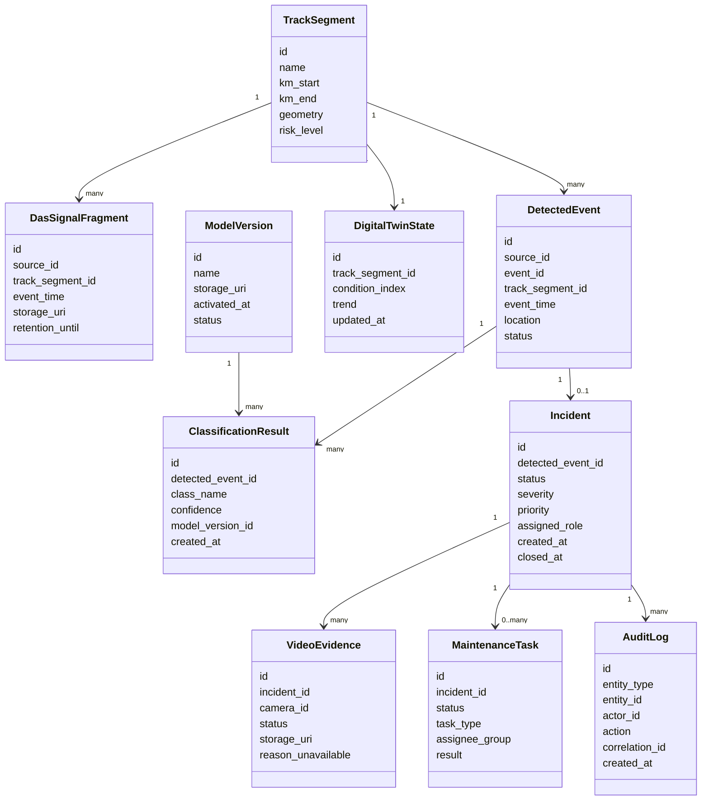

# 07. Данные и хранилища

## Основные сущности

## Источник истины

| Данные | Источник истины | Комментарий |
|---|---|---|
| Участки трассы, координаты, геометрия | PostgreSQL/PostGIS | Используется для привязки событий и поиска камер |
| Состояния инцидентов и заданий | PostgreSQL/PostGIS | Транзакционные данные и audit trail |
| DAS-признаки и временные агрегаты | TimescaleDB | Оптимизировано для временных рядов и аналитики |
| Видео и акустические фрагменты | S3/MinIO | Крупные бинарные артефакты хранятся вне БД |
| Версии моделей | S3/MinIO + PostgreSQL metadata | Файл модели в object storage, метаданные в БД |
| Цифровой двойник | PostgreSQL/PostGIS + TimescaleDB | Текущее состояние в PostgreSQL, тренды в TimescaleDB |

## Правила хранения

| Данные или артефакт | Срок хранения MVP | Как удалить или восстановить |
|---|---|---|
| Инцидент и статус | Долговременно, минимум срок эксплуатации MVP | Не удаляется автоматически, может архивироваться |
| AuditLog | Долговременно | Неизменяемая запись, используется для расследований |
| DAS-признаки | 1-3 года или по регламенту пилота | Агрегировать старые данные, хранить важные участки дольше |
| Сырой акустический фрагмент | Ограниченный срок, например 30-90 дней | Cleanup удаляет объект, metadata остается |
| Видео-фрагмент | Ограниченный срок, например 30-90 дней | Cleanup удаляет объект, карточка сохраняет факт наличия и удаления |
| Версия модели | Пока есть связанные классификации | Не удалять без миграции и решения ответственного |
| DigitalTwinState | Актуальное состояние и история изменений | Восстановить по подтвержденным событиям и результатам осмотров |

## Идентификаторы

| Идентификатор | Где используется | Назначение |
|---|---|---|
| `source_id` | Edge-узел, DAS-интеррогатор, камера | Указывает источник события |
| `event_id` | EdgeEvent, DetectedEvent | Идемпотентность повторной доставки |
| `correlation_id` | Логи, Kafka, API, AuditLog | Связь всех действий одного процесса |
| `model_version_id` | ClassificationResult | Воспроизводимость классификации |
| `track_segment_id` | Все события и задания | Привязка к участку трассы |
| `command_id` | Команды оператора | Защита от повторного создания задания |

## Событийные темы Kafka

| Topic | Producer | Consumer | Назначение |
|---|---|---|---|
| `edge.events` | Edge-узлы | ML workers | Новые события и признаки |
| `ml.classifications` | ML workers | Сервис критичности | Результаты классификации |
| `incidents.commands` | Backend API | Backend / сервис заданий | Команды оператора |
| `incidents.events` | Backend API | Цифровой двойник, наблюдаемость | Доменные события инцидентов |
| `twin.updates` | Сервис цифрового двойника | API / аналитика | Изменения состояния участков |

## Миграции и совместимость

- Схема PostgreSQL мигрируется версионированными SQL-миграциями.
- События Kafka имеют поле `schema_version`.
- Новые классы ML-событий добавляются без удаления старых значений.
- Старые `ClassificationResult` не пересчитываются автоматически при выпуске новой модели.
- При изменении формата признаков ML workers должны поддерживать минимум две версии входного контракта на период перехода.
- Изменения статусов инцидента требуют миграции данных и обновления тестов сценариев.

## Данные, которые нельзя потерять

- Инциденты и их статусы.
- Действия оператора и audit trail.
- Результаты осмотров и закрытия заданий.
- Версии моделей, участвовавшие в классификации.
- Метаданные артефактов, даже если сам видео- или акустический фрагмент удален по retention policy.
