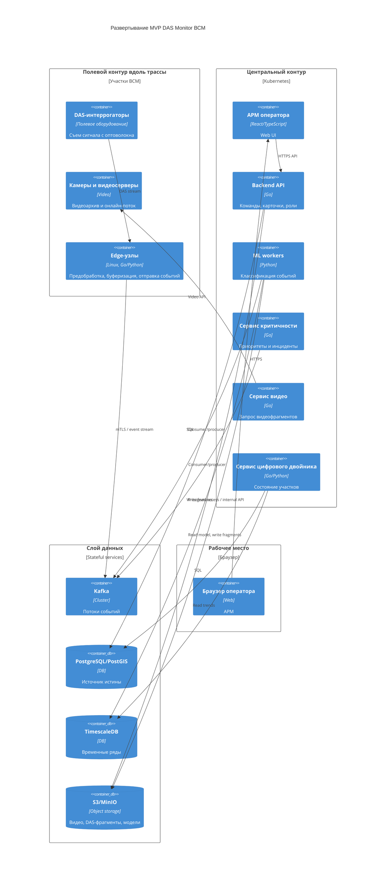

# 08. Развертывание

## Целевая среда

MVP разворачивается в двух типах сред:

- **полевой контур** вдоль трассы: DAS-интеррогаторы, камеры, видеосерверы и edge-узлы на участках;
- **центральный контур**: Kubernetes-кластер с API, workers, Kafka, сервисами аналитики, АРМ и хранилищами.

Для локальной разработки допускается Docker Compose с эмуляторами edge-узлов, камер и Kafka.

## Deployment-диаграмма

## Развертываемые процессы

| Процесс | Тип | Масштабирование |
|---|---|---|
| Backend API | Stateless | Горизонтально по HTTP-нагрузке |
| АРМ оператора | Static web / frontend | Через web-сервер или CDN в защищенном контуре |
| ML workers | Stateless workers | Горизонтально по лагу Kafka |
| Сервис критичности | Stateless consumer | Горизонтально с учетом partitioning |
| Сервис видео | Stateless | Горизонтально по числу запросов к видеосерверам |
| Сервис цифрового двойника | Stateful logic, stateless runtime | Горизонтально осторожно, с блокировками по участку |
| Edge-узел | Локальный процесс | Масштабируется числом участков и интеррогаторов |
| Cleanup job | CronJob | По расписанию, один активный экземпляр |

## Stateful-компоненты

- Kafka cluster.
- PostgreSQL/PostGIS.
- TimescaleDB.
- S3/MinIO.
- Локальный буфер edge-узла при потере связи.

Stateful-компоненты должны иметь резервное копирование, мониторинг места, политики восстановления и отдельные права доступа.

## Конфигурация и секреты

| Секрет / настройка | Где хранить | Комментарий |
|---|---|---|
| TLS-сертификаты edge-узлов | Secret store / Kubernetes Secrets | Нужны для доверенной передачи событий |
| Пароли БД | Secret store | Не хранить в репозитории |
| Ключи S3/MinIO | Secret store | Раздельные права для чтения моделей и записи артефактов |
| Токены видеосерверов | Secret store | Ограничить доступ сервисом видео |
| Параметры retention | ConfigMap / таблица настроек | Меняются без пересборки приложения |
| Активная версия модели | PostgreSQL metadata | Не задавать вручную в переменных окружения |

## Отличия окружений

| Окружение | Особенности |
|---|---|
| Локальное | Docker Compose, эмулятор DAS, fake video API, локальный MinIO |
| Тестовое | Kubernetes namespace, тестовые топики Kafka, синтетические сигналы, набор камер-эмуляторов |
| Предпромышленное | Подключение к пилотному участку или потоку записанных сигналов, реальные edge-узлы |
| Production | Полная карта участков, реальные роли, резервное копирование, алерты, регламенты поддержки |

## Обновление без потери задач

- API и workers обновляются rolling update.
- Kafka consumer должен фиксировать offset только после успешной записи состояния.
- Миграции БД выполняются перед выпуском версии приложения, совместимой со старой и новой схемой.
- Edge-узел при обновлении сохраняет локальный буфер.
- Новая модель сначала регистрируется как `candidate`, затем активируется явно.
