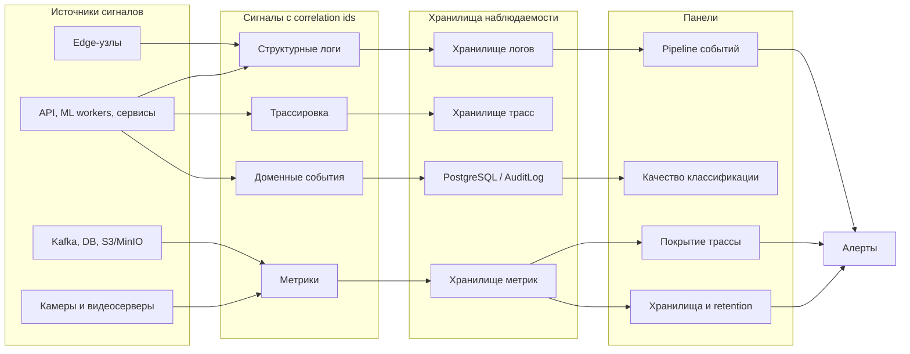

# 09. Надежность и эксплуатация

## Возможные отказы

| Отказ | Поведение системы | Мера снижения |
|---|---|---|
| Потеря связи edge-узла с центром | Edge буферизует события, центральный контур показывает деградацию покрытия | Локальный persistent buffer, алерт по heartbeat |
| Падение ML worker | Сообщение остается в Kafka и обрабатывается другим worker | Consumer group, retries, dead-letter topic |
| Недоступность видеосервера | Инцидент создается без видео, причина фиксируется в карточке | Timeout, retry, fallback на соседнюю камеру |
| Недоступность PostgreSQL | API переводится в degraded mode, команды оператора временно недоступны | Репликация, backup, health checks |
| Рост лага Kafka | События задерживаются, но не теряются | Автомасштабирование consumers, алерт по lag |
| Ошибка новой модели | Увеличивается доля `unknown` или ложных тревог | Canary activation, откат версии модели |
| Переполнение object storage | Новые фрагменты не сохраняются или пишутся с ошибками | Метрики объема, retention cleanup, алерты |

## Повторы и таймауты

| Операция | Retry policy | Идемпотентность |
|---|---|---|
| Отправка EdgeEvent | Повторы до подтверждения доставки | `source_id + event_id` |
| Классификация ML | Повтор сообщения при ошибке worker | `detected_event_id + model_version_id` |
| Запрос видео | 2-3 попытки с timeout, затем fallback | `incident_id + camera_id + time_window` |
| Создание инцидента | Upsert в транзакции | `detected_event_id` |
| Команда оператора | Без автоматического повтора UI, повтор по `command_id` | `command_id` |
| Cleanup артефактов | Повторяемая batch-операция | Метаданные удаления фиксируются в БД |

## Наблюдаемость

## Минимальный набор метрик

| Область | Метрики |
|---|---|
| Edge | heartbeat, размер локального буфера, число событий, ошибки отправки |
| Kafka | lag по consumer group, скорость входящих событий, dead-letter count |
| ML | длительность классификации, confidence distribution, доля `unknown`, ошибка модели |
| Инциденты | число кандидатов, подтверждений, отклонений, среднее время до подтверждения |
| Видео | timeout rate, доля событий с видео, задержка получения фрагмента |
| Хранилища | свободное место, объем S3, возраст артефактов, ошибки cleanup |
| Цифровой двойник | число обновлений, участки с ухудшением индекса, задержка обновления |

## Логи и correlation ids

Каждая запись, связанная с событием, должна содержать:

- `correlation_id`;
- `source_id`;
- `event_id`;
- `detected_event_id`;
- `incident_id`, если создан;
- `track_segment_id`;
- `stage`;
- `attempt`;
- `model_version_id`, если применимо;
- `error_code`, если есть ошибка.

## Алерты

| Алерт | Условие | Действие |
|---|---|---|
| Edge node offline | Нет heartbeat дольше заданного порога | Инженер эксплуатации проверяет связь и питание |
| Kafka lag high | Lag растет дольше N минут | Масштабировать consumers, проверить ML workers |
| Video unavailable rate high | Доля недоступных видео выше порога | Проверить видеосерверы или сеть |
| Unknown class spike | Резкий рост `unknown` | Проверить модель, данные и новые типы событий |
| Storage near full | Свободное место ниже порога | Запустить cleanup, расширить storage |
| Incident review delay | Инциденты ждут оператора дольше SLA | Эскалация старшему оператору |

## Резервное копирование и восстановление

- PostgreSQL/PostGIS: регулярные backup, проверка восстановления, point-in-time recovery при необходимости.
- TimescaleDB: backup агрегатов и признаков, приоритизация последних данных.
- S3/MinIO: versioning или backup для критичных моделей и доказательств.
- Kafka: не считается долговременным хранилищем, состояние восстанавливается из PostgreSQL и producers.
- Edge buffer: локально хранится только до успешной доставки или истечения лимита.

## Ручные операции

- Повторить обработку события из dead-letter topic.
- Принудительно пометить камеру недоступной.
- Откатить активную ML-модель.
- Архивировать устаревшие артефакты.
- Пересчитать состояние цифрового двойника для участка.
- Закрыть зависшее задание с обязательным комментарием и audit trail.
