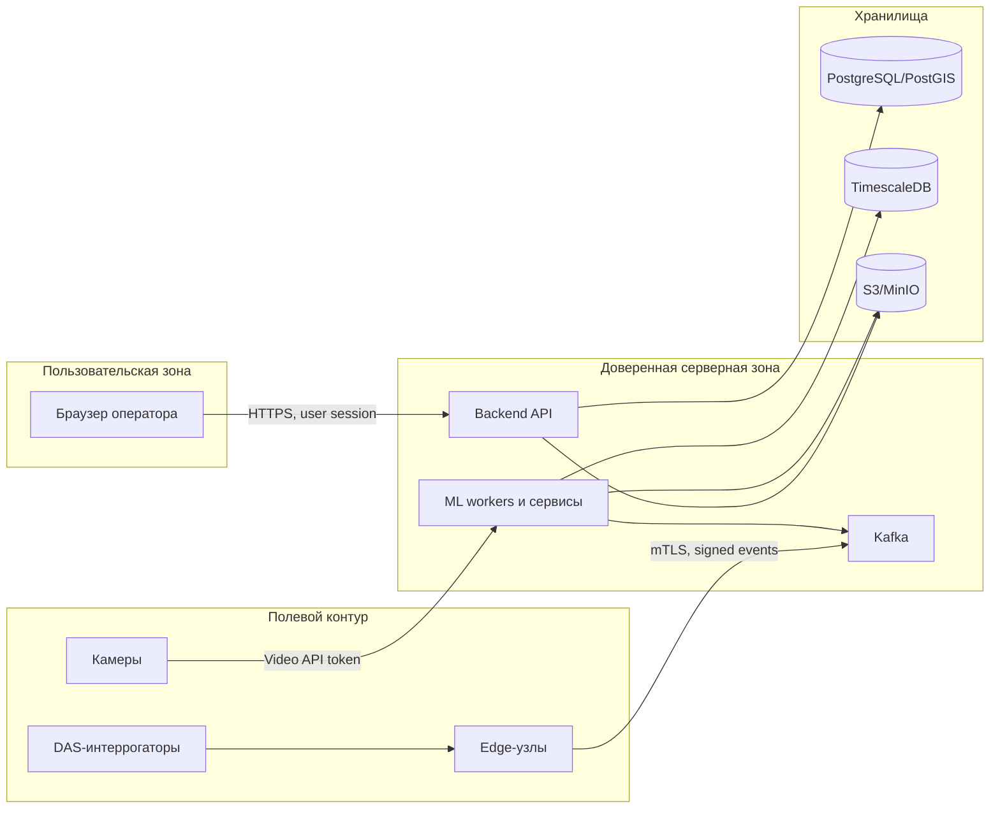

# 10. Безопасность

## Роли

| Роль | Права |
|---|---|
| Оператор мониторинга | Просмотр событий, видео, подтверждение и отклонение инцидентов, создание заданий |
| Служба безопасности | Просмотр событий безопасности, видео по своим инцидентам, комментарии |
| Путевая служба | Просмотр назначенных заданий, изменение статуса задания, внесение результата осмотра |
| Инженер эксплуатации | Просмотр состояния системы, метрик, алертов, технических ошибок |
| ML-инженер | Просмотр качества модели, версий моделей, обезличенных или разрешенных фрагментов |
| Администратор | Управление ролями, настройками, каталогом участков и камер |

## Защищаемые данные

- Видео-фрагменты с камер вдоль трассы.
- Сырые акустические DAS-фрагменты.
- Координаты и время критичных инцидентов.
- Действия операторов и служебные комментарии.
- Модели классификации и признаки.
- Секреты доступа к edge-узлам, БД, Kafka и видеосерверам.

## Границы доверия

## Авторизация

- Все пользовательские операции проходят через Backend API.
- API проверяет роль пользователя и права на объект.
- Доступ к видео и DAS-фрагментам не выдается прямой публичной ссылкой без контроля срока и роли.
- Изменение статуса инцидента и задания требует audit trail.
- Команды оператора защищаются `command_id`, чтобы повторный запрос не создал дубликат.

## Защита внешних входов

| Вход | Риск | Мера |
|---|---|---|
| EdgeEvent | Подмена события или повтор старого события | mTLS, подпись источника, `event_id`, timestamp window |
| Video API | Доступ к чужим камерам или архиву | Сервисный токен, allowlist камер, аудит запросов |
| Пользовательский API | Несанкционированное изменение инцидента | Роли, ownership checks, CSRF/session protection |
| Загрузка модели | Подмена модели или несовместимый формат | Проверка подписи, статус `candidate`, тест перед активацией |
| Комментарии оператора | Инъекции в UI и логи | Валидация, экранирование, ограничение длины |

## Что нельзя писать в логи

- Полные токены и пароли.
- Presigned URLs.
- Сырые фрагменты DAS или видео.
- Персональные данные сотрудников, кроме служебного идентификатора.
- Закрытые координаты объектов, если лог доступен вне защищенного контура.

## Безопасность артефактов

- S3/MinIO bucket для моделей отделен от bucket видео и DAS-фрагментов.
- Доступ к артефактам идет через API или временные ссылки с коротким сроком действия.
- Cleanup удаляет бинарные артефакты по retention policy, но сохраняет metadata.
- Для моделей хранится checksum и дата активации.
- Доступ ML-инженера к сырым данным ограничивается отдельной ролью и журналируется.

## Основные угрозы и меры

| Угроза | Влияние | Мера снижения |
|---|---|---|
| Подмена события edge-узла | Ложный инцидент | mTLS, подпись событий, allowlist источников |
| Несанкционированный просмотр видео | Утечка чувствительных данных | RBAC, временные ссылки, audit trail |
| Ошибка оператора | Неверная реакция | Подтверждение, комментарии, история действий, возможность отклонения |
| Подмена ML-модели | Массовые ложные классификации | Реестр моделей, checksum, canary activation |
| Утечка секретов | Компрометация системы | Secret store, ротация, запрет секретов в репозитории |
| Переполнение storage | Потеря доказательств новых событий | Retention policy, алерты, квоты |
