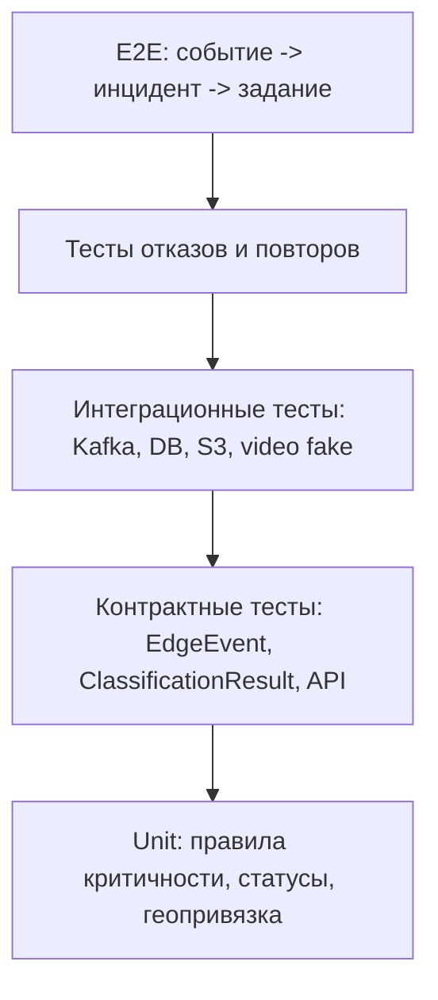

# 11. Тестирование

## Стратегия

Тестирование должно проверять не только интерфейс оператора, но и архитектурные свойства: потоковую обработку, идемпотентность, отказоустойчивость, права доступа, геопривязку, хранение артефактов и воспроизводимость классификации.

## Матрица критичных проверок

| Область | Что проверить | Тип проверки |
|---|---|---|
| EdgeEvent | Формат, schema version, `event_id`, координата, timestamp | Contract |
| Классификация | Классы событий, confidence, `model_version_id` | Unit / integration |
| Критичность | Правила `normal`, `warning`, `incident` | Unit |
| Геопривязка | Событие попадает в правильный `TrackSegment` | Integration с PostGIS |
| Видео | Выбор ближайшей камеры и обработка недоступности | Integration с fake video API |
| Инцидент | Создание карточки и статусы | E2E |
| Задание | Создание только после подтверждения оператора | E2E / security |
| Идемпотентность | Повтор EdgeEvent не создает дубль | Failure test |
| Kafka | Повторная обработка после падения worker | Failure test |
| Security | Пользователь не видит чужие или запрещенные артефакты | Integration / E2E |
| Retention | Cleanup удаляет артефакт и сохраняет metadata | Integration |
| Цифровой двойник | Обновление только по подтвержденному событию | Integration |

## Сценарные тесты приемки

| Сценарий | Ожидаемый результат |
|---|---|
| Вторжение в периметр | Создан инцидент с видео, оператор подтверждает, служба безопасности видит событие |
| Дефект колесной пары | Событие классифицировано, оператор видит поезд/участок, создается запись для проверки |
| Смещение основания | Цифровой двойник ухудшает индекс участка, создается задание на осмотр |
| Камера недоступна | Карточка создана, в ней указана причина отсутствия видео |
| Повтор события | Дубликат не создается, audit trail фиксирует повторную обработку при необходимости |
| Потеря связи edge-узла | Появляется алерт, после восстановления буфер доставляется |
| Ложное срабатывание | Оператор отклоняет инцидент, событие доступно для анализа модели |
| Неавторизованный пользователь | Доступ к карточке, видео или заданию запрещен |

## Нагрузочные проверки

| Проверка | Цель |
|---|---|
| Поток событий со всех участков | Понять лаг Kafka и число ML workers |
| Пиковый поток после сильного шума или работ | Проверить backpressure и фильтрацию |
| Массовая недоступность камер | Убедиться, что сервис видео не блокирует pipeline |
| Рост объема S3/MinIO | Проверить retention и алерты |
| Одновременная работа операторов | Проверить блокировки статусов и audit trail |

## Тестовые данные

- Синтетические EdgeEvent для каждого класса событий.
- Записанные фрагменты DAS после пилота.
- Fake video API с камерами разной доступности.
- Карта тестовых участков с координатами и километражом.
- Набор пользователей с ролями: оператор, служба безопасности, путевая служба, ML-инженер, администратор.
- Версии модели: active, candidate, revoked.

## Проверка трассируемости требований

| Требование | Компонент | Данные | Тест |
|---|---|---|---|
| FR-001 | Edge-узлы, Kafka | DetectedEvent | Contract + integration |
| FR-002 | ML workers | ClassificationResult, ModelVersion | ML integration |
| FR-005 | Сервис видео | VideoEvidence, TrackSegment | Integration |
| FR-007 | АРМ, Backend API | Incident, AuditLog | E2E |
| FR-008 | Backend API | MaintenanceTask | E2E |
| NFR-003 | Kafka consumers, PostgreSQL | `source_id + event_id` | Failure test |
| NFR-006 | Backend API, S3/MinIO | VideoEvidence, DasSignalFragment | Security test |
| NFR-009 | Cleanup job, S3/MinIO | retention metadata | Integration |

## Что проверяется вручную

- Понятность карточки инцидента для оператора.
- Удобство карты и очереди событий.
- Корректность формулировок заданий для путевой службы.
- Разбор спорных классификаций ML-инженером.
- Полнота audit trail при расследовании учебного инцидента.
