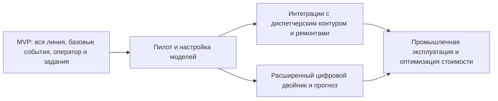

# 12. Риски и развитие

## Главные риски

| Риск | Вероятность | Влияние | Мера снижения |
|---|---|---|---|
| Реальный DAS-поток окажется более шумным, чем ожидается | Средняя | Высокое | Пилот, разметка данных, класс `unknown`, human-in-the-loop |
| Не хватит видео-покрытия для подтверждения событий | Средняя | Высокое | Каталог камер, fallback на соседние камеры, явная причина отсутствия видео |
| Объем сырых данных будет слишком дорогим | Высокая | Среднее | Хранить только фрагменты, признаки и агрегаты, ввести retention |
| Оператор получит слишком много ложных тревог | Средняя | Высокое | Оценка критичности, пороги, анализ `rejected`, улучшение модели |
| Edge-узлы будут нестабильны из-за связи вдоль трассы | Средняя | Высокое | Локальный буфер, heartbeat, алерты, повторная доставка |
| Модель ухудшится на новых условиях | Средняя | Среднее | Мониторинг качества, canary activation, откат модели |
| Интеграция с реальным диспетчерским контуром окажется сложнее | Средняя | Высокое | Не включать в MVP, готовить интерфейс подтвержденных событий |
| Требования безопасности изменятся | Средняя | Среднее | RBAC, audit trail, разделение доверенных зон |

## Ограничения MVP

- MVP не доказывает полную промышленную готовность DAS для всех условий эксплуатации.
- MVP не заменяет действующие регламенты диспетчерского управления.
- Система не выполняет автоматическое ограничение скорости.
- Цифровой двойник в MVP является базовой моделью состояния и трендов, а не полноценной нормативной системой прогноза ресурса.
- Метеоданные и внешняя система ремонтов не являются обязательными интеграциями.
- Реальные параметры задержек, точности и хранения должны быть уточнены на пилоте.

## Технический долг первой версии

| Долг | Почему допускается | Когда закрывать |
|---|---|---|
| Локальное управление ролями в стенде | Упрощает запуск первой версии | До промышленного пилота |
| Ограниченный набор классов событий | Нужны данные для обучения | После накопления размеченного датасета |
| Простые правила критичности | Лучше объяснимы для MVP | После анализа реальных ложных тревог |
| Базовый цифровой двойник | Позволяет начать сбор истории | При переходе к прогнозному обслуживанию |
| Ручное создание заданий внутри системы | Нет интеграции с внешним контуром работ | При согласовании внешней системы |

## Дорожная карта

## Направления развития

- Добавить метеоданные и геологический контекст в цифровой двойник.
- Интегрироваться с внешним диспетчерским контуром только для подтвержденных событий.
- Интегрироваться с системой управления ремонтами и нарядами.
- Расширить классы событий: типы техники, виды дефектов, погодные шумы.
- Добавить активное обучение модели по решениям операторов.
- Ввести прогноз деградации участка и рекомендации по приоритету осмотров.
- Разделить контуры данных для обучения ML и оперативной эксплуатации.

## Решения для пересмотра

| Решение | Когда пересмотреть | Что смотреть |
|---|---|---|
| Kafka как event streaming | Если операционные затраты высоки или поток событий мал | Lag, сложность поддержки, число consumers |
| Разделение PostgreSQL/TimescaleDB/S3 | Если инфраструктура слишком сложна для команды | Стоимость, частота инцидентов, сложность backup |
| Хранение только фрагментов сырого DAS | Если расследования требуют больше контекста | Запросы эксплуатации, стоимость storage, регламент |
| Human-in-the-loop | Если качество классификации и регламенты позволяют автоматизацию | Доля ошибок, время реакции, требования безопасности |
| Отдельный сервис цифрового двойника | Если функциональность остается простой | Частота изменений, нагрузка, границы ответственности |

## Корнер-кейсы для проверки на пилоте

- Поезд и сторонние работы одновременно на соседних координатах.
- Две камеры одинаково близко к событию, одна недоступна.
- Один физический инцидент создает серию похожих DAS-событий.
- Edge-узел доставляет буфер событий после длительной потери связи.
- Модель классифицирует событие с низкой уверенностью, но видео подтверждает опасность.
- Оператор отклоняет событие, а путевая служба позже подтверждает проблему на осмотре.
- Cleanup удалил видео, но нужно объяснить старое решение по audit trail.
